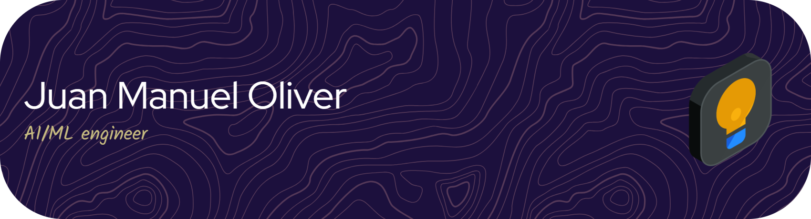

  

Artificial Intelligence and Machine learning engineer. I build models that reach production, not just notebooks. End to end ownership of the product.

Open to Data / ML & AI Engineering roles

### Education

 &nbsp;**KU Leuven** — Advanced Master's in Artificial Intelligence with specialization in Big Data and Analytics

 &nbsp;**UC3M** — BSc in Applied Mathematics & Computer Science · exchange year at   

 

Currently focused on applied ML for sports and AI tools for enterprise use.

 

### Experience

 **Backend AI Developer — Atos**

 **AI Application Developer, Intern — Atos**

 

### Selected work

**ShotPrint** — quantifies shot quality and builds metrics around it while keeping data private via federated learning. Master's thesis at KU Leuven, graded 18/20.  · [github.com/juanma6610/ShotPrint](https://github.com/juanma6610/ShotPrint)

**Duolingo memory engine** — memory modeling that predicts recall probability to optimize study strategy. · [github.com/juanma6610/KUL-Hackaton2026](https://github.com/juanma6610/KUL-Hackaton2026)

**Code The Sky** — [analysis surfacing insight Z] Achieved third place in the Google Developer Group Hackathon · [github.com/juanma6610/BDA_CodeTheSky](https://github.com/juanma6610/BDA_CodeTheSky)

### Tools

 

### Most-used languages

### Elsewhere

